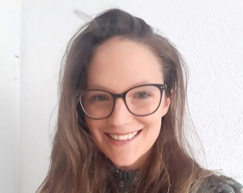

 

The IAIFI Summer Workshop brings together researchers from across Physics and AI for plenary talks, poster sessions, and networking to promote research at the intersection of Physics and AI. We are also accepting submissions for contributed talks and/or posters.

* **The 2025 Summer Workshop will be held August 11–15, 2025**
* **Location: Harvard University (Cambridge, MA)**
* **[Registration is now open](https://buy.stripe.com/fZe9Ci53xfX90eceVb) for the 2025 IAIFI Summer Workshop; Register by July 31, 2025 ($200 registration fee).** 

[Register for the 2025 IAIFI Summer Workshop](https://buy.stripe.com/fZe9Ci53xfX90eceVb){:.button.button--outline-primary.button--pill.button--lg} <!--[Submit a Talk/Poster by June 1, 2025](https://app.smartsheet.com/b/form/dcec880db8f149ef84792b4d34b7fd7d){:.button.button--outline-primary.button--pill.button--lg}-->

Here's what attendees at previous IAIFI Summer Workshops had to say about the experience: 

<iframe width="560" height="315" src="https://www.youtube.com/embed/QRfdc-3o01g?si=oHLv6eRpGUnpe__2" title="YouTube video player" frameborder="0" allow="accelerometer; autoplay; clipboard-write; encrypted-media; gyroscope; picture-in-picture; web-share" allowfullscreen></iframe>

[Agenda](#agenda){:.button.button--outline-primary.button--pill.button--lg} [Speakers](#speakers){:.button.button--outline-primary.button--pill.button--lg} [FAQ](#faq){:.button.button--outline-primary.button--pill.button--lg}   [Accommodations](#accommodations){:.button.button--outline-primary.button--pill.button--lg} [Past Workshops](/past-workshops.html){:.button.button--outline-primary.button--pill.button--lg}

## About
The Institute for Artificial Intelligence and Fundamental Interactions (IAIFI) is enabling physics discoveries and advancing foundational AI through the development of novel AI approaches that incorporate first principles, best practices, and domain knowledge from fundamental physics. The goal of the Workshop is to serve as a meeting place to facilitate advances and connections across this growing interdisciplinary field.
<!--
[View recommendations for meals and activities around MIT](https://docs.google.com/document/d/1Z2qX9Owxi7IV3D2q3xBIXns5y4r3rAps/edit#heading=h.gjdgxs)
-->

## Agenda

*The agenda is subject to change.* 

### Monday, August 11, 2025
**9:00-9:15 am ET**

Welcome

**9:15–10:00 am ET**

*AI in Astrophysics: Tackling Domain Shift, Model Robustness and Uncertainty*

Aleksandra Ciprijanovic, Fermilab

Abstract

<em>Artificial Intelligence is transforming astrophysics, from studying stars and galaxies to analyzing cosmic large-scale structures. However, a critical challenge arises when AI models trained on simulations or past observational data are applied to new observation— leading to domain shifts, reduced robustness, and increased uncertainty of model predictions. This talk will explore these issues, highlighting examples such as galaxy morphology classification and cosmological parameter inference, where AI struggles to adapt across different datasets. We will discuss domain adaptation as a strategy to improve model generalization and mitigate biases—essential for making AI-driven discoveries reliable. Notably, these challenges extend beyond astrophysics, affecting AI applications across physics and other scientific domains. Addressing them is essential for maximizing AI’s impact in advancing scientific research.</em>

**10:00–10:45 am ET**

*Theoretical foundations for language model self-improvement*

Dylan Foster, Microsoft Research

Abstract

<em>Abstract to come.</em>

**10:45-11:15 am ET**

Break

**11:15 am–12:00 pm ET**

*Self-supervised Reinforcement Learning and Generative Models*

Amy Zhang, UT Austin

Abstract

<em>We explore the intersection of generative AI and reinforcement learning, demonstrating how generative models can be understood as RL agents and environments, and conversely, how RL can be viewed as generative modeling. We show how this perspective leads to new forms of self-supervised reinforcement learning algorithms that form new objectives for training generative models. We will discuss future directions and open problems, focusing on how RL can shape the future of foundation model training.</em>

**12:00–1:30 pm ET**

Lunch Break

**1:30–2:15 pm ET**

*Machine Learning for Time-Domain Astrophysics*

Alex Gagliano, IAIFI Fellow

Abstract

<em>Abstract to come.</em>

**2:15–3:00 pm ET**

*Emulating Dark Matter Halo Merger Trees with Generative Models*

Tri Nguyen, CIERA, Northwestern University

Abstract

<em>Merger trees track the hierarchical assembly of dark matter halos and are crucial for semi-analytic galaxy formation models. However, traditional methods rely on ad-hoc assumptions and struggle to incorporate environmental information. I present FLORAH-Tree, a generative model for merger trees by representing them as graph structures that capture the full branching hierarchy. I trained FLORAH-Tree on merger trees from the Very Small MultiDark Planck N-body simulation and validated it against simulation data and Extended Press-Schechter analytical trees. FLORAH-Tree accurately reproduces key merger tree statistics across mass and redshift ranges, outperforming analytical approaches. Applying the Santa Cruz semi-analytic model to generated trees shows that galaxy-halo scaling relations match expectations. FLORAH-Tree provides a computationally efficient method for generating merger trees while maintaining N-body simulation fidelity.</em>

**3:00–3:30 pm ET**

Break

**3:30–4:15 pm ET**

*Multimodal Foundation Models for Scientific Data* 

Francois Lanusse, CNRS

Abstract

<em>Deep Learning has seen a recent shift in paradigm, from training specialized models on dedicated datasets, so-called Foundation Models, trained in a self-supervised manner on vast amounts of data and then adapted to solve specific tasks with state-of-the-art performance. This new paradigm has been exceptionally successful not only for large language models (LLMs) but in other domains such as vision models. In this talk I will discuss several methodologies that can be deployed in our scientific domains, in particular weakly-supervised cross-modal contrastive learning and multimodal self-supervised generative pretraining. I will show how these approaches can be used to build models flexible to very diverse and inhomogeneous observations (e.g. different types of measurements such as spectra, time-series, or images, but also different instruments, etc...) and how they can then be leveraged by the end-user for a variety of downstream applications (e.g. redshift estimation, morphology classification, physical parameter inference, searching for rare objects) with very simple machine learning methods and still reach near-optimal performance.</em>

**4:15-5:00 pm ET**

*Structured Learning for Astrophysical Data*

Peter Melchior, Princeton University

Abstract

<em>Abstract to come.</em>

**5:30–8:00 pm ET**

Poster Session and Reception

### Tuesday, August 12, 2025

**9:00–9:45 am ET**

*(Machine) Learning of Dark Matter*

Lina Necib, MIT

Abstract

<em>Abstract to come.</em>

**9:45–10:30 am ET**

*Learning the Universe: Building a Scalable, Verifiable Emulation Pipeline for Astronomical Survey Science*

Matthew Ho, Columbia University

Abstract

<em>Learning the Universe is developing a large-scale, ML-accelerated pipeline for simulation-based inference in cosmology and astrophysics. By combining high-resolution physical models with fast emulators, we generate realistic training sets at the scale required for field-level inference from galaxy survey data. This enables us to constrain models of galaxy formation and cosmology from observations with unprecedented scale and precision. In designing this pipeline, we have also developed validation methodologies to assess emulator accuracy, identify sources of systematic error, and support blinded survey analysis. I will present results from its application to the SDSS BOSS CMASS spectroscopic galaxy sample and discuss how this approach is scaling to upcoming cosmological surveys.</em>

**10:30-11:00 am ET**

Break

**11:00–11:45 am ET**

*High-dimensional Bayesian Inference with Diffusion Models and Generative Flow Networks*

Alexandre Adam, Université de Montréal

Abstract

<em>The nature of dark matter is one of the greatest mystery in modern cosmology. Little is known about dark matter, other than it has a mass, thus gravitate, and interact with the electromagnetic field weakly, if none at all. Gravitational lensing is a natural phenomena which involves the trajectory of photons from distant galaxies bending by the gravity of massive object in our line of sight. As such, it is one of the most promising probe to study the nature of dark matter. This talk will discuss the problem of inferring the mass of the hypothetic dark matter particle from strong gravitational lens measurement, the challenges involved in such an inference from a Bayesien perspective and the potential solutions offered by modern deep learning framework such as diffusion models and generative flow networks.</em>

**11:45 am–12:30 pm ET**

*Title to come.*

Noemi Anau Montel, Max Planck Institute for Astrophysics

Abstract

<em>Abstract to come.</em>

**12:30–2:00 pm ET**

Lunch

**2:00–3:30 pm ET**

*Contributed Talks - Parallel Sessions*

**3:30–4:00 pm ET**

Break

**4:00–4:45 pm ET**

*Title to come*

Hidenori Tanaka, Harvard University/NTT Research, Inc.

Abstract

<em>Abstract to come.</em>

**4:45-5:30 pm ET**

*Computing with Neural Manifolds in Biological and Artificial Neural Networks*

SueYeon Chung, Harvard University (starting Fall 2025), Flatiron Institute

Abstract

<em>Abstract to come</em>

### Wednesday, August 13, 2025

**9:00–9:45 am ET**

*From Neurons to Neutrons: An Intepretable AI model for Nuclear Physics*

Sokratis Trifinopoulos, MIT/CERN

Abstract

<em>Abstract to come.</em>

**9:45–10:30 am ET**

*Investigating Proton Spatial and Spin Structure with Interpretable AI*

Simonetta Liuti, University of Virginia

Abstract

<em>Abstract to come.</em>

**10:30-11:00 am ET**

Break

**11:00–11:45 am ET**

*Title to come*

Lukas Heinrich, Technical University Munich

Abstract

<em>Abstract to come.</em>

**11:45 am–12:30 pm ET**

*AI on the Edge: Decoding Particles, Brains, and Cosmic Collisions in Real Time*

Shih-Chieh Hsu, University of Washington

Abstract

<em>Artificial Intelligence is transforming scientific discovery at every scale-from the subatomic to the cosmic-by enabling real-time data analysis with unprecedented speed and precision. The A3D3 Institute leads this revolution, leveraging advanced hardware like FPGAs and GPUs, cutting-edge model compression, and specialized inference frameworks to accelerate breakthroughs in particle physics, neuroscience, and multi-messenger astrophysics. This talk highlights how A3D3’s innovations are powering instant detection of rare events, live decoding of brain signals, and rapid response to cosmic phenomena, ushering in a new era where AI turns massive data streams into actionable insights as they happen.</em>

**12:30–2:00 pm ET**

Lunch

**2:00–3:30 pm ET**

*Contributed Talks - Parallel Sessions*

**3:30–4:00 pm ET**

Break

**4:00–5:00 pm ET**

*Building an AI Scientist: Best Practices for Vibe Coding*

Panel TBA

**6:00–8:00 pm ET**

*Workshop Dinner*

Museum of Science

### Thursday, August 14, 2025

**9:00–9:45 am ET**

*Low latency machine learning at the LHCb experiment*

Eluned Smith, MIT

Abstract

<em>With an anticipated input rate of 200 Tb/s, the LHCb experiment demands real-time data reduction at the detector level to prevent irreversible loss of valuable physics information. This talk presents an overview of efforts to deploy machine learning inference directly on compact, radiation-tolerant FPGAs located near the detector readout—an environment that imposes stringent constraints on latency and resource utilization. As a concrete example, I highlight the use of Variational Autoencoders (VAEs) that can simultaneously compress waveforms and extract precise timestamps within the required latency budget. I also discuss other potential and ongoing machine learning applications within LHCb's front-end systems.</em>

**9:45–10:30 am ET**

*Towards Complete Automation in Particle Image Inference*

Francois Drielsma, SLAC

Abstract

<em>Particle imaging detectors have had a ubiquitous role in particle physics for over a century. The unrivaled level of detail they deliver has led to many discoveries and continues to make them an attractive choice in modern experiments. The liquid argon time projection chamber (LArTPC) technology – a dense, scalable realization of this detection paradigm – is the cornerstone of the US-based accelerator neutrino program. While the human brain can reliably recognize patterns in particle interaction images, automating this reconstruction process has been an ongoing challenge which could jeopardize the success of LArTPC experiments. Recent leaps in computer vision, made possible by machine learning (ML), have led to a remedy. We introduce an ML-based data reconstruction chain for particle imaging detectors: a multi-task network cascade which combines voxel-level feature extraction using Sparse Convolutional Neural Networks and particle superstructure formation using Graph Neural Networks. It provides a detailed description of an image and is currently used for state-of-the-art physics inference in three LArTPC experiments. Building on this success, we briefly inrtoduce the potential of leveraging self-supervised learning – the core concept of cutting-edge large language models – to learn the fundamental structure of detector data directly from a large corpus of raw, unlabeled data. This novel approach could address current shortcomings in signal processing and reduce the impact of data/simulation disagreements.</em>

**10:30-11:00 am ET**

Break

**11:00–11:45 am ET**

*Foundation Models for Detector Data: progress, potential, and concerns*

Michelle Kuchera, Davidson College

Abstract

<em>Abstract to come.</em>

**11:45 am–12:30 pm ET**

*Deep(er) Reconstruction of Imaging Cherenkov Detectors: From Generative Towards Foundation Models*

Cristiano Fanelli, William & Mary

Abstract

<em>Abstract to come.</em>

**12:30–2:00 pm ET**

Lunch

**2:00–3:30 pm ET**

*Contributed Talks - Parallel Sessions*

**3:30–4:00 pm ET**

Break

**4:00–4:45 pm ET**

*Machine Learning inroads into the Bootstrap programme*

Costis Papageorgakis, Queen Mary University of London

Abstract

<em>I will survey recent advances in applying machine learning to the bootstrap programme in theoretical physics. I will discuss the use of reinforcement learning in high-dimensional searches for Conformal Field Theory (CFT) data, neural operators for finding scattering-matrix phases and neural network applications for bootsrapping CFTs at finite temperature. I will also touch upon investigations using large language models for analysing high-energy theory abstracts.</em>

**4:45–5:30 pm ET**

*Title to come.*

Sven Krippendorf, University of Cambridge

Abstract

<em>Abstract to come.</em>

### Friday, August 15, 2025

**9:00–9:45 am ET**

*Generative quantum advantage for classical and quantum problems*

Hsin-Yuan (Robert) Huang, Caltech, Google

Abstract

<em>Abstract to come.</em>

**9:45–10:30 am ET**

*Artificial intelligence for quantum matter*

Liang Fu, MIT

Abstract

<em>Abstract to come.</em>

**10:30-11:00 am ET**

Break

**11:00–11:45 am ET**

*Understanding inference-time compute: Self-improvement and scaling*

Akshay Krishnamurthy, Microsoft Research

Abstract

<em>Inference-time compute has emerged as a new axis for scaling large language models, leading to breakthroughs in AI reasoning. Broadly speaking, inference-time compute methods involve allowing the language model to interact with a verifier to search for desirable, high-quality, or correct responses. While recent breakthroughs involve using a ground-truth verifier of correctness, it is also possible to invoke the language model itself or an otherwise learned model as verifiers. These latter protocols raise the possibility of self-improvement, whereby the AI system evaluates and refines its own generations to achieve higher performance.  This talk presents new understanding of and new algorithms for language model self-improvement. The first part of the talk focuses on a new perspective on self-improvement that we refer to as sharpening, whereby we "sharpen" the model toward one placing large probability mass on high-quality sequence, as measured by the language model itself. We show how the sharpening process can be done purely at inference time or amortized into the model via post-training, thereby avoiding expensive inference-time computation. In the second part of the talk, we consider the more general setting of a learned reward model, show that the performance of naive-but-widely-used inference-time compute strategies does not improve monotonically with compute, and develop a new compute-monotone algorithm with optimal statistical performance.  Based on joint works with Audrey Huang, Dhruv Rohatgi, Adam Block, Qinghua Liu, Jordan T. Ash, Cyril Zhang, Max Simchowitz, Dylan J. Foster and Nan Jiang.</em>

**11:45 am–12:30 pm ET**

*A Physics-informed Approach To Sensing*

Petros Boufounos, Mitsubishi Electric Research Laboratories

Abstract

<em>Physics-based models are experiencing a resurgence in signal processing applications. Thanks to developments in theory and computation it is now practical to incorporate models of dynamical systems within signal processing pipelines, learning algorithms and optimization loops. Advances in learning theory, such as Physics-Informed Neural Networks (PINNs) also allow for flexible and adaptive modeling of systems, even if the exact system model is not available at the algorithm design stage. In this talk we will explore how these new capabilities improve sensing systems and enable new capabilities is a variety of applications and modalities. We will discuss applications in underground imaging, fluid modeling and sensing, and airflow imaging, among others, and investigate different approaches to developing and using these models, their advantages and pitfalls.</em>

**12:30–2:00 pm ET**

Lunch

**2:00–2:45 pm ET**

*State of AI Reasoning for Theoretical Physics - Insights from the TPBench Project*

Moritz Münchmeyer, University of Wisconsin-Madison

Abstract

<em>Large-language reasoning models are now powerful enough to perform mathematical reasoning in theoretical physics at graduate or even research level. In the mathematics community, data sets such as FrontierMath are being used to drive progress and evaluate models, but theoretical physics has so far received less attention. In this talk I will first present our dataset TPBench (arxiv:2502.15815, tpbench.org), which was constructed to benchmark and improve AI models specifically for theoretical physics. I will analyze both the strengths and remaining weaknesses of LLMs in theoretical physics reasoning, and discuss strategies to improve their performance. I will then show our new results (arxiv:2506.20729) comparing different test-time scaling techniques on TPBench, including sequential and parallel reasoning methods combined with symbolic verification to boost performance.</em>

**2:45–3:30 pm ET**

*A model of emergent abilities in learning from language*

Yasamin Bahri, Google DeepMind

Abstract

<em>Abstract to come</em>

**3:30–4:00 pm ET**

Closing

## Speakers

Speakers will be announced as they are confirmed. 
 

  <!--
-->
    
    

         
         

         

         <a href="https://github.com/AlexandreAdam">Alexandre Adam</a>
         

         

         <em> University of Montreal </em>  
         

         

       

       
    

         
         

         

         <a href="https://noemiam.github.io/">Noemi Anau Montel</a>
         

         

         <em> Max-Planck Institute for Astrophysics </em>  
         

         

       

    

         
         

         

         <a href="https://sites.google.com/view/yasamanbahri/home">Yasaman Bahri</a>
         

         

         <em> Google DeepMind </em>  
         

         

       

    

         
         

         

         <a href="https://boufounos.com/">Petros Boufounos</a>
         

         

         <em> MERL </em>  
         

         

       

    

         
         

         

         <a href="https://sites.google.com/site/sueyeonchung/">SueYeon Chung</a>
         

         

         <em> Harvard University </em>  
         

         

       

    

         
         

         

         <a href="https://www.alexciprijanovic.com/">Aleksandra Ciprijanovic</a>
         

         

         <em> FNAL </em>  
         

         

       

    

         
         

         

         <a href="https://profiles.stanford.edu/francois-drielsma">Francois Drielsma</a>
         

         

         <em> SLAC National Accelerator Laboratory </em>  
         

         

       

    

         
         

         

         <a href="https://cristianofanelli.com/">Cristiano Fanelli</a>
         

         

         <em> William & Mary </em>  
         

         

       

    

         
         

         

         <a href="https://dylanfoster.net/">Dylan Foster</a>
         

         

         <em> Microsoft </em>  
         

         

       

    

         
         

         

         <a href="https://physics.mit.edu/faculty/liang-fu/">Liang Fu</a>
         

         

         <em> MIT and IAIFI </em>  
         

         

       

    

         
         

         

         <a href="https://alexandergagliano.github.io/">Alexander Gagliano</a>
         

         

         <em> IAIFI </em>  
         

         

       

    

         
         

         

         <a href="https://www.lukasheinrich.com/">Lukas Heinrich</a>
         

         

         <em> Technical University Munich </em>  
         

         

       

    

         
         

         

         <a href="https://maho3.github.io/">Matthew Ho</a>
         

         

         <em> Columbia University </em>  
         

         

       

    

         
         

         

         <a href="https://faculty.washington.edu/schsu/">Shih-Chieh Hsu</a>
         

         

         <em> University of Washington </em>  
         

         

       

    

         
         

         

         <a href="https://hsinyuan-huang.github.io/">Hsin-Yuan (Robert) Huang</a>
         

         

         <em> Caltech and Google </em>  
         

         

       

    

         
         

         

         <a href="https://krippendorflab.github.io/">Sven Krippendorf</a>
         

         

         <em> University of Cambridge </em>  
         

         

       

    

         
         

         

         <a href="https://people.cs.umass.edu/~akshay/">Akshay Krishnamurthy</a>
         

         

         <em> Microsoft </em>  
         

         

       

    

         
         

         

         <a href="https://alpha-davidson.github.io/">Michelle Kuchera</a>
         

         

         <em> Davidson College </em>  
         

         

       

    

         
         

         

         <a href="https://flanusse.net/">Francois Lanusse</a>
         

         

         <em> CNRS </em>  
         

         

       

    

         
         

         

         <a href="https://uva.theopenscholar.com/simonetta-liuti/">Simonetta Liuti</a>
         

         

         <em> University of Virginia </em>  
         

         

       

    

         
         

         

         <a href="https://pmelchior.net/">Peter Melchior</a>
         

         

         <em> Princeton University </em>  
         

         

       

    

         
         

         

         <a href="https://www.moritzmunchmeyer.com/">Moritz Münchmeyer</a>
         

         

         <em> University of Wisconsin-Madison </em>  
         

         

       

    

         
         

         

         <a href="https://lnecib.com/">Lina Necib</a>
         

         

         <em> MIT and IAIFI </em>  
         

         

       

    

         
         

         

         <a href="https://trivnguyen.github.io/">Tri Nguyen</a>
         

         

         <em> Northwestern University and SkAI </em>  
         

         

       

    

         
         

         

         <a href="https://www.qmul.ac.uk/spcs/staff/academics/profiles/cpapageorgakis.html">Costis Papageorgakis</a>
         

         

         <em> Queen Mary University of London </em>  
         

         

       

    

         
         

         

         <a href="https://physics.mit.edu/faculty/eluned-smith/">Eluned Smith</a>
         

         

         <em> MIT and IAIFI </em>  
         

         

       

    

         
         

         

         <a href="https://sites.google.com/view/htanaka/home">Hidenori Tanaka</a>
         

         

         <em> Harvard University and IAIFI </em>  
         

         

       

    

         
         

         

         <a href="https://strifinopoulos.github.io/">Sokratis Trifinopoulos</a>
         

         

         <em> MIT and IAIFI </em>  
         

         

       

    

         
         

         

         <a href="https://amyzhang.github.io/">Amy Zhang</a>
         

         

         <em> UT Austin </em>  
         

         

       

 

## Accommodations
We have established discounted rates for August 10–August 16, 2025 at the following hotels:

* <b>Porter Square Hotel</b>, 1924 Massachusetts Avenue, Cambridge, MA 02142. 
    
    $235-275 nightly rate (1-2 people per room)
    
    Deadline to book: First come, first served

    To book, call 617-499-3399 and reference code 141315.
    
* <b>Hotel 1868</b>, 1868 Massachusetts Avenue, Cambridge, MA 02142. 
    
    $225-265 nightly rate (1-2 people per room)
    
    Deadline to book: First come, first served

    To book, call 617-499-3399 and reference code 141315.
    
Workshop attendees are also welcome to book dorms for a discounted rate at Harvard University: 
* <b>Harvard University Dorms, 36 Oxford Street, Cambridge, MA 02138</b>

    $110 nightly rate (1 person per room only) 

    [Book now](https://buy.stripe.com/cN23dUdA37qD6CAdRa)

## FAQ 
* *Who can attend the Summer Workshop?* Any researcher working at or interested in the intersection of physics and AI is encouraged to attend the Summer Workshop. 
* *What is the cost to attend the Summer Worskhop?* The registration fee for the Summer Workshop is 200 USD and includes a welcome dinner, as well as coffee breaks and snacks.
* *If I come to the Summer School, can I also attend the Workshop?* Yes! We encourage you to stay for the Workshop and you can stay in the dorms for both events if you choose (at your expense). 
* *Will the recordings of the talks be available?* We plan to share the talks on our [YouTube channel](https://www.youtube.com/channel/UCueoFcGm_15kSB-wDd4CBZA).

[Submit a question or comment](https://app.smartsheet.com/b/form/76c1d070d19d4688b65962c4ed190478){:.button.button--outline-primary.button--pill.button--sm}

## 2025 Organizing Committee 
* Fabian Ruehle, Chair (Northeastern University)
* Bill Freeman (MIT) 
* Cora Dvorkin (Harvard)
* Thomas Harvey (IAIFI Fellow)
* Sam Bright-Thonney (IAIFI Fellow)
* Sneh Pandya (Northeastern)
* Yidi Qi (Northeastern)
* Manos Theodosis (Harvard)
* Marshall Taylor (MIT)
* Marisa LaFleur (IAIFI Project Manager)
* Thomas Bradford (IAIFI Project Coordinator)
