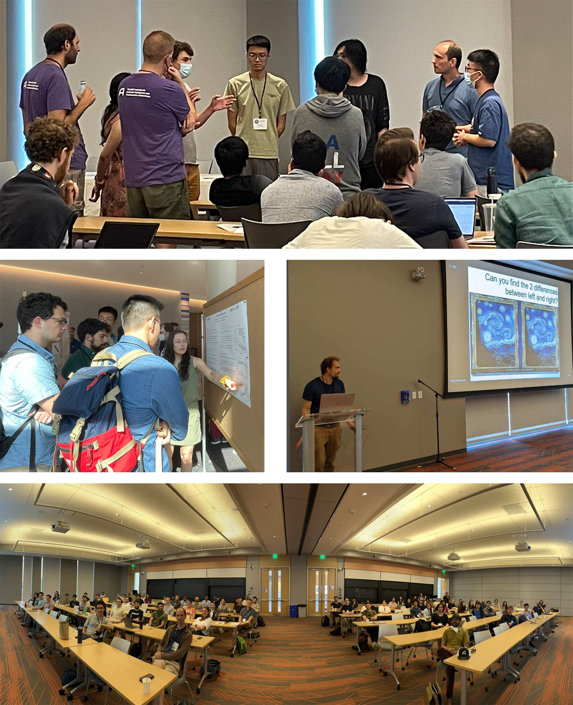

 
* [Summer Workshop 2023](#summer-workshop-2023) 
  * [Registration](#registration)
  * [Accommodations](#accommodations)
  * [Plenary Speakers](#plenary-speakers)
* [FAQ](#faq)
* [Summer Workshop 2022](#summer-workshop-2022)

## Summer Workshop 2023
The IAIFI Summer Workshop brings together researchers from across Physics and AI for two days of plenary talks, poster sessions, and networking to promote research at the intersection of Physics and AI. 

**This year's Summer Workshop will be held at Northeastern University, August 14–18, 2023.**

### Workshop Registration
Registration for the Summer Workshop is now open. The registration fee for in-person attendance is 250 USD and includes coffee breaks for both days, as well as a dinner on the first night. 
[Register for IAIFI Summer Workshop](https://iaifi-workshop-reg-fee.mit.edu/registration){:.button.button--outline-primary.button--pill.button--sm}

**Note: If you are an IAIFI Senior Investigator and would like to use your IAIFI funds to cover registration for you or your group, [contact iaifi@mit.edu](mailto:iaifi@mit.edu). If you are an IAIFI Junior Investigator, speak to the IAIFI Senior Investigator you work with to ask about funding.**

### Accommodations
Accommodation options will be provided later in Spring 2023.

### Plenary Speakers
The following speakers have accepted invitations to give plenary talks at this year's workshop. We will continue to add to the list as speakers accept. 

* [Phiala Shanahan](https://physics.mit.edu/faculty/phiala-shanahan/), MIT/IAIFI
* [Flavio du Pin Calmon](https://people.seas.harvard.edu/~flavio/), Harvard
* [Karsten Kreis](https://karstenkreis.github.io), NVIDIA
* [Boris Hanin](https://boris-hanin.github.io), Princeton
* [Sho Yaida](https://www.shoyaida.com), Meta
* [Yasaman Bahri](https://research.google/people/YasamanBahri/), Google
* [Rose Yu](https://roseyu.com), UCSD
* [Greg Yang](https://www.microsoft.com/en-us/research/people/gregyang/videos/), Microsoft
* [Sergei Gukov](http://theory.caltech.edu/~gukov/), California Institute of Technology
* [Eva Silverstein](https://sitp.stanford.edu/people/eva-silverstein), Stanford
* [David Berman](https://www.qmul.ac.uk/spcs/staff/academics/profiles/dsberman.html), Queen Mary University
* [Magdalena Larfors](https://www.katalog.uu.se/profile/?id=N3-1163), Uppsala University
* [Brian Nord](http://briandnord.com/bio), Fermilab
* [Gary Shiu](https://www.physics.wisc.edu/directory/shiu-gary/), University of Wisconsin-Madison

### 2023 Organizing Committee 
* Jim Halverson, Chair (Northeastern University)
* Shuchin Aeron (Tufts)
* Denis Boyda (IAIFI Fellow)
* Anna Golubeva (IAIFI Fellow)
* Ouail Kitouni (MIT)
* Nayantara Mudur (Harvard)
* Sneh Pandya (Northeastern)

## FAQ 
* *Who can attend the Summer Workshop?* Any researcher working at or interested in the intersection of physics and AI is encouraged to attend the Summer Workshop. 
* *What is the cost to attend the Summer Worskhop?* The registration fee for the Summer Workshop is 250 USD and includes a welcome dinner, as well as coffee breaks.
* *If I come to the Summer School, can I also attend the Workshop?* Yes! We encourage you to stay for the Workshop and will cover the cost of your registration if you attend both the Summer School and Workshop in person. 
* *Will the recordings of the talks be available?* We plan to share the talks on our [YouTube channel](https://www.youtube.com/channel/UCueoFcGm_15kSB-wDd4CBZA).

[Submit a question or comment](https://app.smartsheet.com/b/form/76c1d070d19d4688b65962c4ed190478){:.button.button--outline-primary.button--pill.button--sm}

## Summer Workshop 2022

The first annual Summer Workshop was held hybrid with ~110 in-person attendees from 10 different countries. The Workshop included 82% of the Summer School students who stayed to partake. 

### Workshop Agenda

[Download PDF of agenda](images/2022-workshop-agenda.pdf)

[View the detailed agenda for the IAIFI Summer Workshop](https://iaifi.org/workshop-agenda)

### Plenary Speakers 2022
**IAIFI Investigators/Affiliates in bold**

* [Siamak Ravanbakhsh](https://www.siamak.page), Assistant Professor, School of Computer Science, McGill University
* [Greg Yang](https://www.microsoft.com/en-us/research/people/gregyang/), Senior Researcher, Microsoft Research
* **[Phil Harris](https://physics.mit.edu/faculty/philip-harris/)**, Assistant Professor of Physics, MIT
* [Kazuhiro Terao](https://www.codingkazu.com), Staff Scientist, Stanford University
* [Claudius Krause](https://claudius-krause.gitlab.io), Postdoctoral Associate, Rutgers University
* **[Fabian Ruehle](https://cos.northeastern.edu/people/fabian-ruehle/)**, Assistant Professor, Northeastern University
* [Yi-Zhuang You](https://physics.ucsd.edu/Directory/Person/536), Assistant Professor, University of California, San Diego
* [Jennifer Ngadiuba](https://inspirehep.net/authors/1244433), Wilson Fellow, Fermilab
* **[Shuchin Aeron](http://www.ece.tufts.edu/~shuchin/)**, Associate Professor, Tufts University
* **[Cora Dvorkin](https://dvorkin.physics.harvard.edu)**, Associate Professor, Harvard University
* [Sébastien Racanière](https://scholar.google.com/citations?user=o-h0vrQAAAAJ&hl=en), Staff Research Engineer, DeepMind
* **[Anna Golubeva](https://annagolubeva.github.io)**, IAIFI Fellow

## FAQ 
* *Who can apply to the Summer School?* Any PhD students or early career researchers working at the intersection of physics and AI may apply to the summer school. 
* *What is the cost to attend the Summer School?* There is no registration fee for the Summer School. Students for the Summer School are expected to cover the cost of travel and boarding in Tufts dorm rooms, which range from 78 USD to 109 USD per night depending on the accommodations. Breakfast and lunch will be provided through Tufts dining hall.
* *Is there funding available to support my attendance at the Summer School?* IAIFI is covering the cost of the Summer School other than travel and lodging. Limited, need-based support may be available for attendees who are unable to cover the costs of travel and lodging and will be addressed on a case-by-case basis. 
* *If I come to the Summer School, can I also attend the Workshop?* Yes! We encourage you to stay for the Workshop and will cover the cost of your registration if you attend both the Summer School and Workshop in person. 
* *Will the recordings of the lectures and/or talks be available?* We are working on making the videos available and will share them on this page as soon as they are. 

## 2022 Organizing Committee
* Jim Halverson, Chair (Northeastern University)
* Tess Smidt (MIT)
* Taritree Wongjirad (Tufts)
* Anna Golubeva (IAIFI Fellow)
* Dylan Rankin (MIT)
* Jeffrey Lazar (Harvard)
* Peter Lu (MIT)
